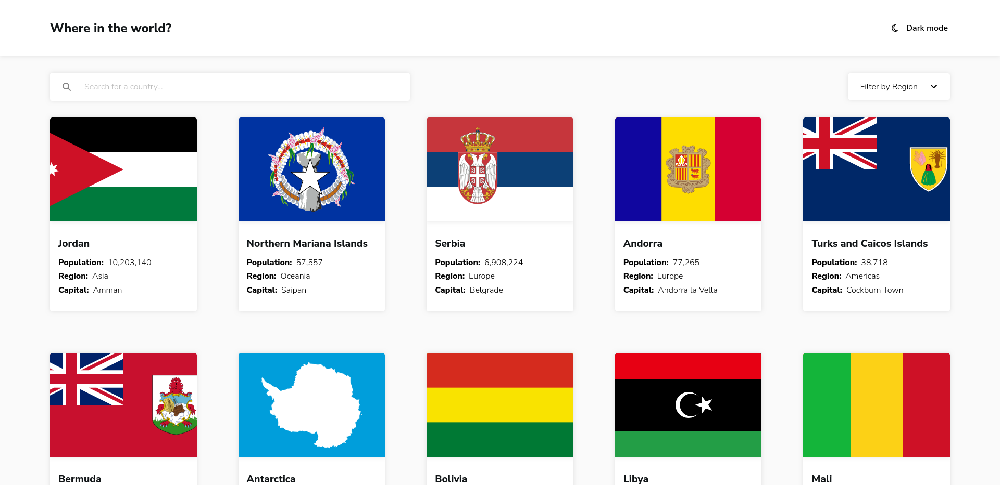

# Frontend Mentor - REST Countries API with color theme switcher solution

This is a solution to the [REST Countries API with color theme switcher challenge on Frontend Mentor](https://www.frontendmentor.io/challenges/rest-countries-api-with-color-theme-switcher-5cacc469fec04111f7b848ca). Frontend Mentor challenges help you improve your coding skills by building realistic projects. 

## Table of contents

- [Overview](#overview)
  - [The challenge](#the-challenge)
  - [Screenshot](#screenshot)
  - [Links](#links)
- [My process](#my-process)
  - [Built with](#built-with)
  - [What I learned](#what-i-learned)
- [Author](#author)

## Overview
Web application using React and SASS, leveraging the RestCountries API to display detailed information about different countries. A key highlight is that I have implemented the routing manually, giving me greater control over the application's navigation. The goal is to provide an interactive and visually appealing experience for users to easily explore and discover data about various countries.

### The challenge

Users should be able to:

- See all countries from the API on the homepage
- Search for a country using an `input` field
- Filter countries by region
- Click on a country to see more detailed information on a separate page
- Click through to the border countries on the detail page
- Toggle the color scheme between light and dark mode

### Screenshot

### Links

- Solution URL: [Repository](https://github.com/blazo-dev/frontendmentor-react-countries-app)
- Live Site URL: [Site](https://blazo-countries-app.netlify.app/)
### Built with

- Semantic HTML5 markup
- CSS custom properties
- Flexbox
- CSS Grid
- Mobile-first workflow
- [React](https://react.dev/) - JS library

### What I learned

In this project, I have learned and applied several key concepts:

- Custom Hooks: I utilized custom hooks to encapsulate and reuse logic efficiently.
- Manual React Router: I implemented routing functionality manually, gaining a deeper understanding of navigation in React.
- API Consumption: I successfully fetched data from the RestCountries API and integrated it into my application.
- Global State Management: I employed techniques like Redux or React Context API to manage shared data across components.
- Responsive Web Design: I ensured my application's adaptability to different devices and screen sizes.
- Leveraging React APIs: I utilized various React features, such as lifecycle methods, hooks, and the virtual DOM.

These learnings have enhanced my development skills and deepened my understanding of modern web development practices.

## Author

- Frontend Mentor - [@blazo-dev](https://www.frontendmentor.io/profile/blazo-dev)
- Linkedin - [@blazodev](https://www.linkedin.com/in/bryanlazodev/)
- Github - [@blazo-dev](https://github.com/blazo-dev)
